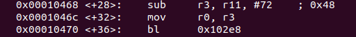
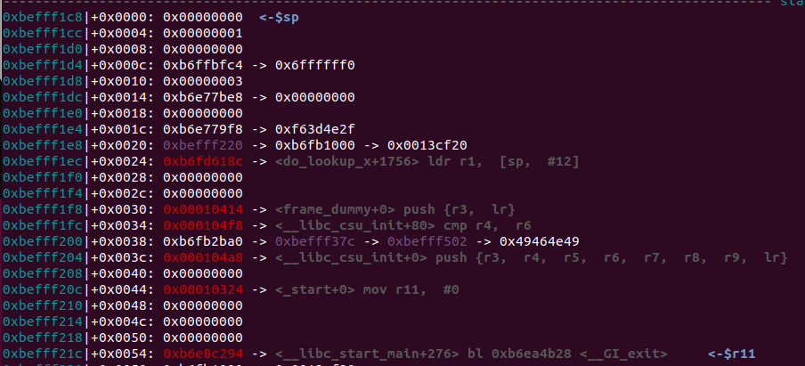
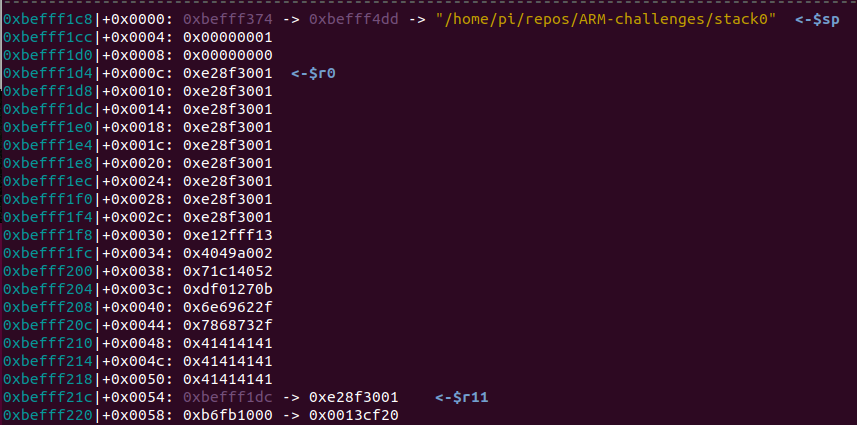
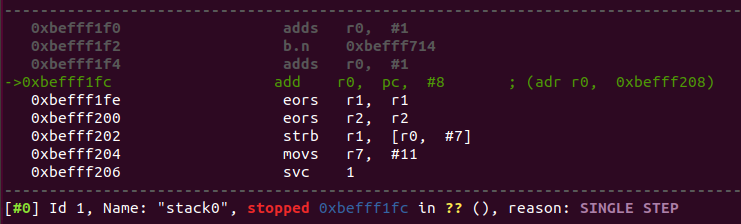
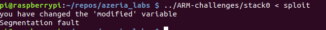
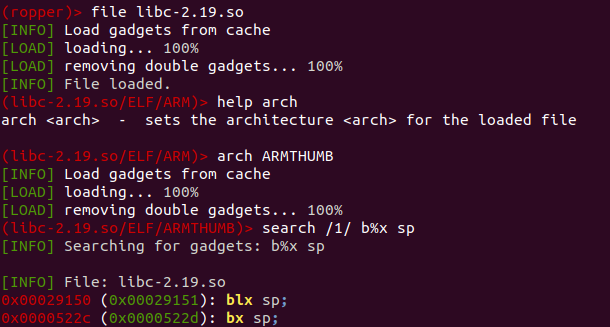
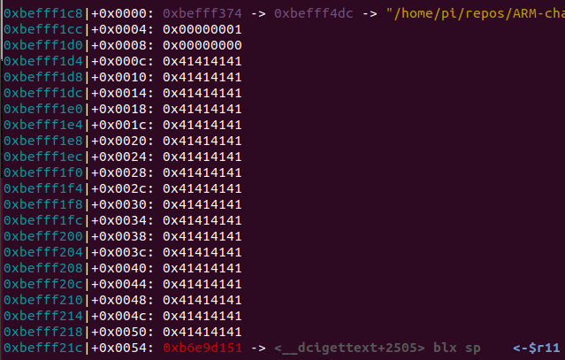
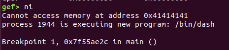

# Azeria Labs ARM training notes
## Stack0
The stack of the main function has a size of 80 bytes. However, all calculations for variables are done from the frame pointer which is pointing at the saved link register(return address) on the stack. The buffer is loaded into r3 for the call to the 'gets' like function. r3 gets the address from the frame pointer - 72.
 

Before the overflow you can see different values on the stack such as the addresses of do_lookup, frame_dummy and others. The important value we are trying to overwrite is 0xb6e8c294 at the bottom of the stack pointed to by r11 the frame pointer. This is the address of where we want to return in __libc_start_main.
 

With an overflow of 76 bytes we can overwrite the saved frame pointer at frame pointer - 4 and the saved link register(return address) at frame pointer. Below you can see the stack is now populated by nop values (0xe28f3001), followed by shellcode, followed by some overflow (0x41414141) to pad out space, then the value with which we overwrite the saved link register. The __libc_start_main value has been replaced with a stack address which will cause execution to start somewhere in our nop values.
 

Here you can see the shell code running
 

However, when the same exploit blob is run without GDB all we get is a segfault...
Unsure why we are not getting a shell.
 

## ROP
Using ropper was through GEF was problematic on the RPi, despite setting up via pip GEF always seemed to think it was missing, resulting in unknown commands when run via GEF. 

I ended up running it on Ubuntu, which was suggested by the lab for speed reasons, and it worked well with a few caveats.
1. before the search for gadgets I had to set the arch as seen below
 
2. It may be obvious to some but the ropper gives offsets, which then need to be added to the start of the library as found with GEF vmmap
3. I had my shell code setup as part of the overflow but when using a gadget like blx sp the shellcode must start directly below the return address. When pop {r11, pc} occurs placing your address to the ROP gadget (blx sp) into pc, sp will be moved two words down the stack as part of the normal function of a pop instruction. Since the ROP gadget branches to sp and sp now points below where the return address was that is where your shellcode needs to be. As you can see below only overflow fills the stack now, shellcode is below the return address.
 

Once again, I see a message in GEF stating a process has kicked off, but I only get a seg fault when running in the terminal...

